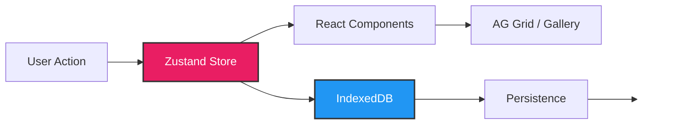

<div align="center">

# 🖼️ Image Mapper

### *The Ultimate Product-to-Image Mapping Tool*

[](https://react.dev/)
[](https://vitejs.dev/)
[](https://tailwindcss.com/)
[](https://opensource.org/licenses/MIT)

**A blazing-fast, local-first web application for mapping product images to CSV data with an intuitive split-panel interface, intelligent auto-mapping, and advanced search.**

[Features](#-features) • [Quick Start](#-quick-start) • [Usage](#-usage-guide) • [Tech Stack](#-tech-stack) • [Architecture](#-architecture)

</div>

---

## 🎯 What is Image Mapper?

Image Mapper is a powerful tool designed for e-commerce teams, product managers, and data professionals who need to efficiently map product images to spreadsheet data. No server required - everything runs locally in your browser with enterprise-grade performance.

### 💡 Perfect For:
- 📦 **E-commerce Teams**: Bulk product image management for online stores
- 🏭 **Manufacturers**: Mapping product catalogs to images
- 📊 **Data Teams**: Organizing visual assets with structured data
- 🛒 **Shopify/WooCommerce**: Preparing product imports with images
- 📸 **Photographers**: Organizing client product shoots

---

## ✨ Features

<table>
<tr>
<td width="50%">

### 🎨 **Beautiful Interface**
- **Split-Panel Layout**: Resizable grid + gallery view
- **Dark Mode**: Auto + manual with seamless transitions
- **Modern Design**: Clean, professional Tailwind v4 styling
- **Responsive**: Works on desktop and tablet

</td>
<td width="50%">

### ⚡ **Blazing Performance**
- **Handle 8K+ Images**: Optimized for massive datasets
- **Instant Search**: MiniSearch with fuzzy matching
- **Virtual Scrolling**: Smooth even with thousands of products
- **Smart Caching**: IndexedDB persistence

</td>
</tr>
<tr>
<td width="50%">

### 🧠 **Intelligent Features**
- **Auto-Map**: AI-powered SKU matching
- **Fuzzy Search**: Finds products even with typos
- **CSV Sync**: Automatic mapping from CSV columns
- **Multi-Image Support**: Map unlimited images per product

</td>
<td width="50%">

### 🔒 **Privacy First**
- **100% Local**: No server, no uploads, no tracking
- **Browser Storage**: IndexedDB for large datasets
- **File System API**: Direct folder access (Chrome/Edge)
- **Offline Ready**: Works without internet

</td>
</tr>
</table>

---

## 🚀 Quick Start

### Prerequisites
```bash
Node.js 18+  |  Modern Browser (Chrome 86+, Firefox 113+, Safari 16.4+)
```

### Installation

```bash
# Clone the repository
git clone <your-repo-url>
cd image-mapper

# Install dependencies
npm install

# Start development server
npm run dev

# Build for production
npm run build
```

**🎉 That's it! Open [http://localhost:5173](http://localhost:5173) and start mapping!**

---

## 📖 Usage Guide

### 1️⃣ Import Your Product Data

<table>
<tr>
<td width="60%">

Click **Import → Import CSV** and select your product spreadsheet.

**Supported Formats:**
- ✅ CSV files
- ✅ Excel exports (.csv)
- ✅ Any delimiter (auto-detected)

**Column Selection:**
- Choose which columns to display
- Select or create image column
- Preview data before importing

</td>
<td width="40%">

```csv
SKU,Product Name,Price
ABC123,Blue T-Shirt,29.99
XYZ789,Red Hoodie,49.99
```

**Auto-detects:**
- SKU columns
- Product names
- Image columns (if any)

</td>
</tr>
</table>

### 2️⃣ Load Your Images

<table>
<tr>
<td width="50%">

#### 📁 **Folder Import** (Recommended)
Click **Import → Image Folder**
- Select entire folder
- Preserves structure
- Fast bulk loading

</td>
<td width="50%">

#### 🖼️ **File Import**
Click **Import → Image Files**
- Multi-select images
- Drag & drop support
- Flexible selection

</td>
</tr>
</table>

**✨ Smart Features:**
- Automatic SKU extraction from filenames
- Format support: JPG, PNG, GIF, WebP, BMP
- 10MB per image limit
- Lazy thumbnail loading

### 3️⃣ Map Products to Images

<table>
<tr>
<td width="33%">

#### 🖱️ **Manual Mapping**
1. Select product(s) in grid
2. Click images to map/unmap
3. Multi-product mapping supported

</td>
<td width="33%">

#### 🤖 **Auto-Map**
1. Click **Auto Map**
2. Select matching column
3. Review suggested matches
4. Apply selected mappings

</td>
<td width="33%">

#### 🔄 **CSV Sync**
1. Import CSV with images
2. Click **Sync from CSV**
3. Automatically maps matches
4. Works with existing data

</td>
</tr>
</table>

### 4️⃣ Export Your Mappings

Click **Export → Export All Columns + Mappings**

**Output includes:**
- ✅ All original CSV columns
- ✅ Mapped image filenames (comma-separated)
- ✅ Image count per product
- ✅ Ready for import to e-commerce platforms

---

## 🛠️ Tech Stack

<div align="center">

### Core Technologies

| Technology | Version | Purpose |
|------------|---------|---------|
| **React** | 18.3 | UI Framework |
| **Vite** | 7.1 | Build Tool & Dev Server |
| **Tailwind CSS** | v4 | Styling (CSS-first config) |
| **AG Grid** | Community | Professional Data Grid |
| **Zustand** | 5.0 | State Management |
| **MiniSearch** | Latest | Advanced Search Engine |

### Key Features by Library

</div>

#### 🎨 **Tailwind CSS v4** - Next-Gen Styling
```css
/* No more tailwind.config.js! */
@import "tailwindcss";

@theme {
  --color-primary: hsl(217 91% 60%);
  --color-success: hsl(142 71% 45%);
  /* CSS variables for theming */
}

@custom-variant dark (&:where(.dark, .dark *));
```

**Why v4?**
- ⚡ 3.5x faster builds
- 🎯 CSS-first configuration
- 🎨 Native CSS variables
- 🔧 Automatic content detection

#### 📊 **AG Grid Community** - Enterprise-Grade Grid
- Virtual scrolling for 10K+ rows
- Column resizing, reordering, pinning
- Advanced filtering and sorting
- Excel-style keyboard navigation
- **Why AG Grid over MUI?** Better performance, more features, framework-agnostic

#### 🔍 **MiniSearch** - Powerful Search
- Fuzzy matching (handles typos)
- Prefix search (search-as-you-type)
- Relevance scoring
- Optimized for 8K+ items
- **Replaced FlexSearch** for better ES module support

#### 💾 **Zustand** - Simple State Management
```js
const useStore = create((set) => ({
  products: [],
  mappings: {},
  addMapping: (productId, image) => set(/* ... */),
}))
```
- 90% less boilerplate than Redux
- 1KB bundle size
- Built-in persistence
- No context providers needed

---

## 🏗️ Architecture

### Project Structure

```
src/
├── components/
│   ├── layout/              # App shell, split panels
│   │   ├── AppLayout.jsx    # Main layout container
│   │   ├── SplitPanel.jsx   # Resizable split view
│   │   └── ThemeToggle.jsx  # Dark mode switcher
│   ├── grid/                # Product grid (left panel)
│   │   ├── DataGrid.jsx     # AG Grid wrapper
│   │   ├── GridToolbar.jsx  # Import, export, auto-map
│   │   └── cell-renderers/  # Custom cell components
│   ├── gallery/             # Image gallery (right panel)
│   │   ├── ImageGallery.jsx # Image grid/list view
│   │   └── ImageThumbnail.jsx # Lazy-loaded thumbnail
│   └── modals/              # Column selector, auto-map preview
├── hooks/
│   ├── useMiniSearch.js     # Search hook
│   ├── useFileSystem.js     # File/folder picker
│   ├── useImageWorker.js    # Web Worker for images
│   └── useDebounce.js       # Search debouncing
├── store/
│   ├── imageMapperStore.js  # Main app state (Zustand)
│   └── themeStore.js        # Theme state
├── utils/
│   ├── csvParser.js         # CSV parsing with PapaParse
│   ├── tokenMatching.js     # SKU matching algorithm
│   └── db.js                # IndexedDB wrapper
└── index.css                # Tailwind v4 config
```

### State Management Flow



### Data Flow Architecture

1. **Import CSV** → Parse → Store in `products` array
2. **Load Images** → Extract SKUs → Store in `images` array
3. **Create Mapping** → Update `mappings` object → Save to IndexedDB
4. **Export** → Merge products + mappings → Generate CSV

---

## ⚙️ Advanced Configuration

### Search Configuration

Edit `src/hooks/useMiniSearch.js`:

```js
const miniSearch = new MiniSearch({
  fields: ['searchableText'],
  searchOptions: {
    fuzzy: 0.2,      // Typo tolerance (0-1)
    prefix: true,    // Enable prefix search
    combineWith: 'AND' // Search logic
  }
});
```

### Grid Customization

Edit `src/components/grid/DataGrid.jsx`:

```js
const gridOptions = {
  paginationPageSize: 100,  // Rows per page
  animateRows: true,        // Smooth updates
  maintainColumnOrder: true // Persist column state
}
```

### Performance Tuning

```js
// Adjust image loading batch size
const IMAGES_PER_LOAD = 50; // Default: 50

// Change debounce delay for search
const SEARCH_DEBOUNCE_MS = 300; // Default: 300ms
```

---

## 🎨 Theming Guide

### Color Customization

Edit `src/index.css`:

```css
@theme {
  /* Brand Colors */
  --color-primary: hsl(217 91% 60%);
  --color-success: hsl(142 71% 45%);
  --color-error: hsl(0 84% 60%);

  /* Semantic Colors */
  --color-background: hsl(0 0% 100%);
  --color-foreground: hsl(222 47% 11%);
  --color-muted: hsl(210 40% 96%);
  --color-border: hsl(214 32% 91%);
}

/* Dark mode overrides automatically applied */
```

### Custom Variants

```css
@custom-variant hover (&:hover);
@custom-variant dark (&:where(.dark, .dark *));
@custom-variant mobile (@media (max-width: 768px));
```

---

## 🔧 Troubleshooting

<details>
<summary><b>Images not loading?</b></summary>

**Check:**
- ✅ File size under 10MB
- ✅ Supported format (JPG, PNG, GIF, WebP, BMP)
- ✅ Browser has file access permissions
- ✅ Console for errors (F12)

**Fix:** Clear browser cache and reload
</details>

<details>
<summary><b>Column state not persisting?</b></summary>

**Solution:** Column widths/positions are saved to localStorage. If issues occur:
1. Open DevTools (F12)
2. Go to Application → Storage → Local Storage
3. Clear `image-mapper-state`
4. Reload page
</details>

<details>
<summary><b>Search not working?</b></summary>

**Check:**
- ✅ Data imported successfully
- ✅ Search term at least 2 characters
- ✅ No special characters causing issues

**Fix:** Try fuzzy search (allows typos)
</details>

<details>
<summary><b>Build failing?</b></summary>

```bash
# Clear node_modules and cache
rm -rf node_modules package-lock.json dist
npm install
npm run build
```
</details>

---

## 🌐 Browser Compatibility

| Feature | Chrome | Edge | Firefox | Safari |
|---------|--------|------|---------|--------|
| **Core App** | ✅ 86+ | ✅ 86+ | ✅ 113+ | ✅ 16.4+ |
| **File System API** | ✅ 86+ | ✅ 86+ | ⚠️ Flag | ❌ Fallback |
| **IndexedDB** | ✅ 24+ | ✅ 12+ | ✅ 16+ | ✅ 10+ |
| **Web Workers** | ✅ 4+ | ✅ 12+ | ✅ 3.5+ | ✅ 4+ |
| **Tailwind v4** | ✅ 111+ | ✅ 111+ | ✅ 128+ | ✅ 16.4+ |

**Note:** For older browsers, downgrade to Tailwind v3.4

---

## 📊 Performance Benchmarks

| Metric | Value | Notes |
|--------|-------|-------|
| **Products** | 10,000+ | Virtual scrolling |
| **Images** | 8,000+ | Lazy loading |
| **Search** | <50ms | MiniSearch with indexing |
| **Grid Render** | <100ms | AG Grid virtualization |
| **Bundle Size** | 1.5MB | Gzipped: ~350KB |
| **Initial Load** | <2s | Code splitting |

---

## 🔮 Roadmap

### v2.0 - Q1 2025
- [ ] **Drag & Drop**: Bulk file upload
- [ ] **ZIP Support**: Extract and map images from ZIP files
- [ ] **Image Preview**: Lightbox gallery view
- [ ] **Undo/Redo**: History management

### v2.5 - Q2 2025
- [ ] **Cloud Sync**: Optional Google Drive integration
- [ ] **Collaboration**: Share sessions via link
- [ ] **API Export**: Push to Shopify/WooCommerce
- [ ] **Batch Edit**: Multi-product operations

### v3.0 - Q3 2025
- [ ] **AI Features**: Auto-categorization, duplicate detection
- [ ] **Image Processing**: Crop, resize, compress
- [ ] **Advanced Filters**: Complex product queries
- [ ] **Reporting**: Analytics dashboard

---

## 🤝 Contributing

Contributions are welcome! Please follow these steps:

1. Fork the repository
2. Create a feature branch (`git checkout -b feature/amazing-feature`)
3. Commit your changes (`git commit -m 'Add amazing feature'`)
4. Push to the branch (`git push origin feature/amazing-feature`)
5. Open a Pull Request

**Development Guidelines:**
- Follow existing code style
- Add tests for new features
- Update documentation
- Run `npm run lint` before committing

---

## 📄 License

**MIT License** - See [LICENSE](LICENSE) file for details

```
Copyright (c) 2025 Image Mapper

Permission is hereby granted, free of charge, to any person obtaining a copy
of this software and associated documentation files (the "Software"), to deal
in the Software without restriction, including without limitation the rights
to use, copy, modify, merge, publish, distribute, sublicense, and/or sell
copies of the Software...
```

---

## 💬 Support

Need help? Here's how to get support:

- 📖 **Documentation**: Check this README first
- 🐛 **Bug Reports**: [Open an issue](../../issues/new)
- 💡 **Feature Requests**: [Start a discussion](../../discussions/new)
- 📧 **Email**: support@imagemapper.dev

---

## 🙏 Acknowledgments

Built with these amazing open-source projects:

- [React](https://react.dev/) - UI library
- [Vite](https://vitejs.dev/) - Build tool
- [Tailwind CSS](https://tailwindcss.com/) - Styling framework
- [AG Grid](https://www.ag-grid.com/) - Data grid
- [MiniSearch](https://github.com/lucaong/minisearch) - Search engine
- [Zustand](https://github.com/pmndrs/zustand) - State management
- [PapaParse](https://www.papaparse.com/) - CSV parser
- [Lucide Icons](https://lucide.dev/) - Icon library

---

<div align="center">

### ⭐ Star this repo if you find it useful!

**Made with ❤️ using Vite + React + Tailwind CSS v4**

[⬆ Back to Top](#-image-mapper)

</div>